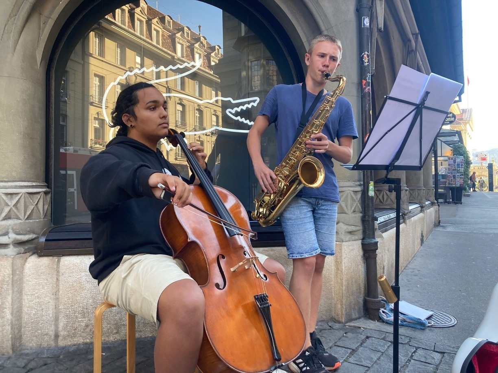
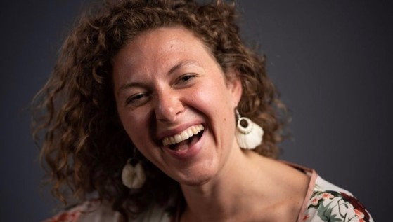
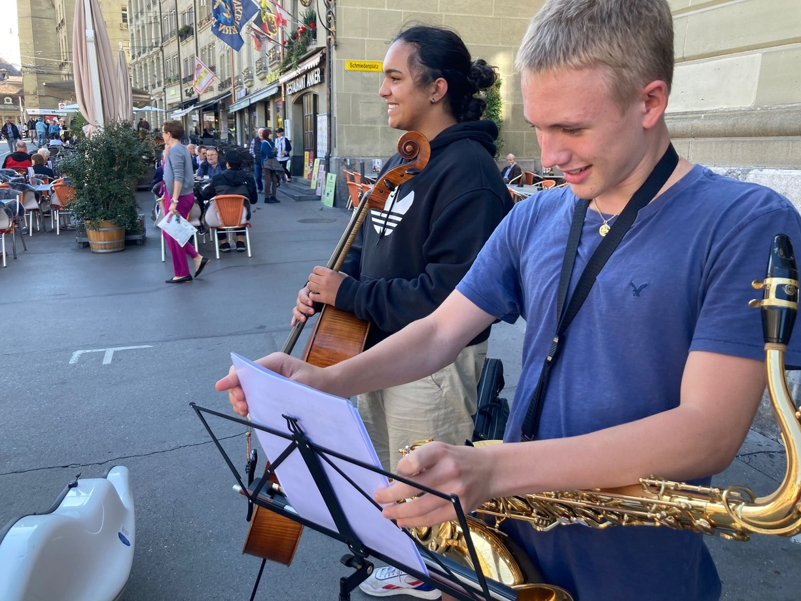
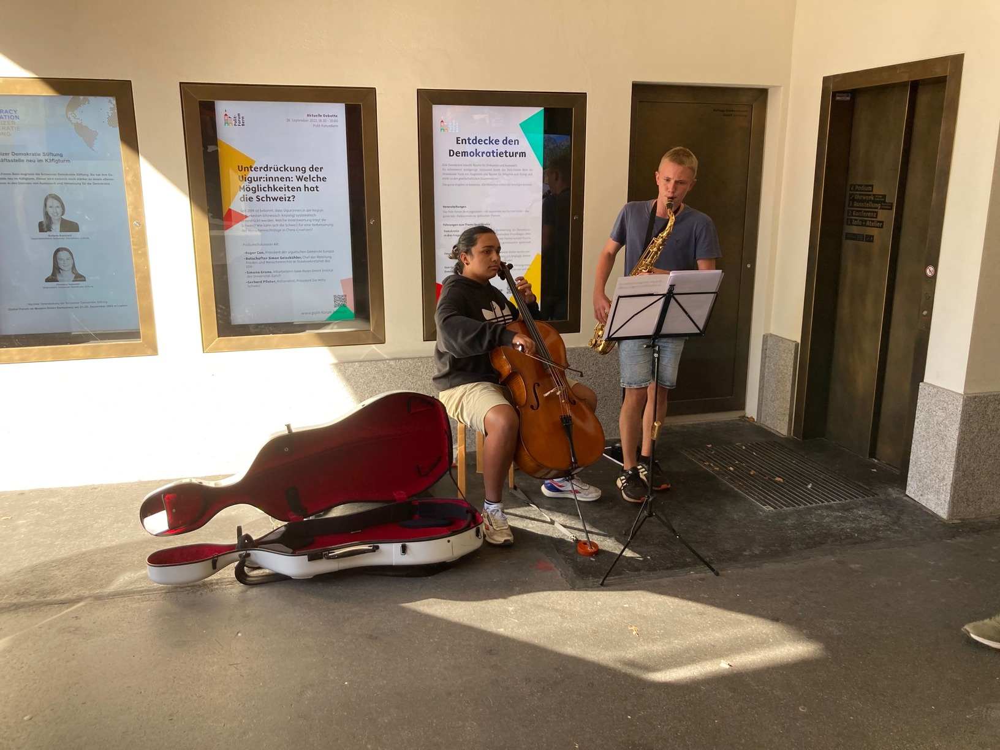

+++
title = "Der Klang der Berner Strassen"
date = "2022-12-02"
draft = false
pinned = false
tags = ["Deutsch", "Reportage"]
image = "microsoftteams-image-1-.jpg"
+++


Strassenkunst ist ein fester Bestandteil der Stadt Bern. Ob in den Lauben oder auf dem Bahnhofsplatz, jeden Tag findet man Personen, welche ihre Kunst mit der Öffentlichkeit teilen wollen. Wir – Simon, Guillaume und Santhosh, drei Schüler des Gymnasiums Kirchenfeld – haben uns für einen Nachmittag in das Leben eines Strassenkünstlers versetzt. 

*Eine Reportage von Guillaume, Simon und Santhosh.*



Musik begegnet man jeden Tag und in jeder Kultur auf verschiedenste Weise. Egal ob schöne Melodien, rhythmische Wörter oder dissonante Geräusche, grundsätzlich gehört jeder Ton zur Musik. Diese Vielfalt der Musik ist der Grund, weshalb wir zu grossen Liebhabern der Musik gehören. Diese Diversität zeigt sich am stärksten in der Strassenmusik. Von simplen Sängern mit Gitarre bis zu komplizierten Impressionisten, die mit ihrer Stimme die Melodie singen und gleichzeitig mit Händen und Füssen die Begleitung trommeln, ist alles vorhanden. Ebenfalls ist die Interaktion der Zuhörer*innen bei der Strassenmusik am grössten.
Wir spielen alle ein Instrument, und die Idee, zusammen Strassenmusik zu machen und mit unserer Musik Freude zu verbreiten, schwebte schon lange in unseren Köpfen. Nach langer Planung haben wir diese Idee nun umgesetzt.

## Vorbereitung auf den Auftritt



Claudia Zimmermann ist die Cousine von Simon. Momentan ist sie als Ärztin in Mittelamerika unterwegs. Seit ihrem 19 Lebensjahr ist ihr Hobby die Strassenkunst. Genauer gesagt spielt sie Feuershows, Ukulele, singt und gibt einstudierte Acroyogashows mit Partnern zum Besten. Sie hat viele Regionen der Welt bereist und hat dabei viele Eindrücke gesammelt. Ihre Begeisterung für die Strassenkunst lebt sie auch auf Strassenkunstfestivals aus, bei welchen sie schon oft gearbeitet hat und sogar aufgetreten ist.



In den Wochen vor unserem geplanten Auftritt treffen wir uns mit Simons Cousine und Strassenkünstlerin Claudia Zimmermann, um herauszufinden, was uns als Strassenkünstler erwarten wird. Einer der Hauptpunkte, welchen wir aus dem Gespräch ziehen können, ist, dass der Kontakt zum Publikum viel direkter und ungefilterter ist als beim Vorspielen auf einer Bühne. Wenn den Zuschauer*innen gefällt, was sie sehen oder hören, bleiben sie stehen, wenn es ihnen nicht gefällt, gehen sie weiter. Claudia erwähnt ebenfalls Unterschiede zu Videos im Internet. So sagt sie, dass der Nervenkitzel bei Echtzeitvorstellungen viel grösser sei als bei TikTok-Videos, welche oft gekünstelt und surreal wirken.

> «Im Vergleich zu beispielsweise einem TikTok-Video, welches stark gekünstelt und fast surreal wirkt, ist der Nervenkitzel einer Echtzeitvorstellung unbezahlbar.»
>
> *Claudia Zimmermann*

Für Claudia ist die direkte Nähe zum Publikum der grösste Anreiz der Strassenmusik. Sie erzählt uns davon, dass, sobald sich ein Publikum gebildet hat, eine Energie und Atmosphäre zwischen Publikum und Künstler entsteht, welche die kunstschaffende Person zu absoluten Spitzenleistungen antreiben kann.

> «Man kann auch mit dem Publikum interagieren, man lernt neue Leute kennen, sieht ihre Reaktionen, hört ihren Applaus, spürt die in der Luft pulsierenden Energiewellen.»
>
> *Claudia Zimmermann*

## Treffpunkt

Es ist der 22.09.2022 und die Uhr schlägt 15:15 Uhr. Ich – Santhosh – bin gerade mit meinem Cello und meinem Stuhl am Kornhausplatz angekommen. Es ist ein sonniger Herbstnachmittag und es weht eine leichte Bise. Während unserer Vorbereitung haben wir den Kornhausplatz als unseren ersten Spielort ausgewählt, da dort viele Menschen aus den verschiedensten Quartieren der Stadt Bern zusammenkommen. Zum Zeitpunkt meiner Ankunft befinden sich etwa. 30 Personen auf dem Kornhausplatz: Neben dem Kindlifresserbrunnen besammelt sich eine Seniorengruppe und an den Aussentischen des Restaurant Anker haben sich mehrere Menschen zusammengefunden. Ich stationiere mich zwischen dem Kindlifresserbrunnen und dem Kornhausforum. Simon und Guillaume sind noch nicht an unserem Treffpunkt angekommen. Während meines Wartens fallen mir schon zwei potenziell negative Faktoren des Kornhausplatzes auf. Die Strasse am Kornhausplatz ist zum Zeitpunkt meines Daseins stark befahren, da die Bauarbeiten im Breitenrain währenddessen auf Hochtouren laufen und sich die benötigten Baufahrzeuge über die Kornhausbrücke fortbewegen. Ebenfalls fällt mir die rastlose Art der Menschen am Kornhausplatz ins Auge. Falls jemand stehen bleibt, dann nur für kurze Zeit. Dies negativen Faktoren beunruhigen mich zuerst nicht, dies wird sich jedoch in den folgenden Minuten ändern. Ich werde aus meinen Gedanken herausgerissen, als Simon und Guillaume auf mich zukommen. Simon hat sein Tenorsaxofon und seinen Notenständer in der Hand. Nach der Begrüssung beginnen wir uns aufzustellen und ich informiere die beiden über meine Beobachtungen in Bezug auf unsere Spielbedingungen.

## Probleme am Kornhausplatz

Während ich mein Cello auspacke, spielt sich Simon ein. Während Simons Einspielen tritt ein erster positiver Faktor ans Licht: Man hört das Saxofon – trotz des Strassenlärms – auf dem ganzen Platz, weshalb wir zum ersten Mal die Aufmerksamkeit erregen. Dies erfreut uns sehr, da uns der Lärm der Baufahrzeuge zuerst sehr beunruhigt hat. Wir erwarten dieselben Ergebnisse für das Cello, werden leider massiv enttäuscht. Als wir anfangen zu spielen, bemerken wir sehr schnell, dass das Cello zu leise ist. Ich kann mich selbst fast nicht spielen hören. Dies beunruhigt mich sehr, da ich keine Kontrolle darüber habe, ob ich korrekt spiele oder nicht. Simon wird ebenso unruhig, als er meine Unruhe bemerkt, und weist mich daraufhin, dass er meine Begleitung nicht hören kann. Zu diesem Zeitpunkt haben wir die Aufmerksamkeit der Zuhörer fast komplett verloren. Die Seniorengruppe hört uns zuerst kurz zu, geht dann jedoch schnell weiter, was uns extrem enttäuscht. In meinem Kopf fange ich an zu überlegen, ob wir für den Rest des Tages erfolglos bleiben werden. Nach 5 Minuten Spielen hören wir auf, um zu besprechen, wie wir fortfahren wollen. Um trotz der schlechten Bedingungen das Beste aus der Situation zu machen, entscheiden wir uns dafür, die schlechte akustischen Konditionen dafür zu brauchen, uns einzuspielen. Während des Einspielens verbessert sich unser Gemüt sehr und wir erzeugen während des Spielens eine gute Chemie zwischen uns. Nach einer Viertelstunde entscheiden wir uns dafür, unseren Spielort zu wechseln.

## Erste Erfolge beim Käfigturm

Als nächsten Ort wählen wir den Fussgängerweg unter dem Käfigturm aus. Der Tunnel ist uns in den vorangehenden Wochen aufgrund seiner guten akustischen Bedingungen aufgefallen und nach dem vorherigen Misserfolg ist gute Akustik für uns die höchste Priorität. Als wir beim Käfigturm ankommen, ist das Erste, was wir testen, ob das Cello im Fussgängerweg gut hörbar sei, da dies beim Kornhausplatz das Hauptproblem gewesen ist. Zu unserer Erleichterung stellt sich der Käfigturmtunnel als perfekter Spielort für das Cello heraus, da die hallenden Wände des Tunnels den Klang des Cellos extrem gut tragen. Als wir anfangen zu spielen, machen sich die verbesserten Bedingungen direkt bemerkbar. Uns gelingt das Musizieren am besten, wenn wir unseren Kopf ausschalten und eins mit der Musik werden können. Dies gelingt uns im Fussgängerweg vom ersten Ton an. Die verbesserte Akustik macht sich auch bei unserer Zuhörerschaft bemerkbar. Es halten viele Menschen an, um uns zuzuhören. Diese positive Reaktion auf unser Spielen hilft uns, noch mehr eins mit der Musik zu werden. Während dem Spielen fällt uns auf, dass die meisten Reaktionen der vorbeigehenden Menschen von älteren Personen und von Eltern mit Kindern kommen. Jüngere Einzelpersonen reagieren fast gar nicht auf unser Spielen. Dies führt zu einem sehr guten Spielerlebnis, jedoch ist nicht alles perfekt am Käfigturm. Der Tunnel ist sehr eng, er hat gerade genug Platz, damit wir mit unseren Instrumenten gut hereinpassen und trotzdem noch Menschen an uns vorbeilaufen können. Jedoch hat er zu wenig Platz, damit sich eine grosse Gruppe an Zuhörern bilden kann, da diese sonst den Weg versperrt. Während dem Spielen bemerken wir, dass zwei unserer Lieder besonders gut beim Publikum ankommen. Diese sind der Marsch «When the saints go marching in» und der im Jahr 2010 herausgekommene Pop-Hit «River flows in you». Als wir mit unserem Programm fertig sind, entscheiden wir uns dafür, noch etwas zu improvisieren. Diese Idee schwirrt schon länger in unseren Köpfen herum und nach unserem Erfolg haben wir genug Selbstvertrauen gesammelt, um diese nun durchzuführen. In unserer Besprechung entscheiden wir uns dafür, dass wir die Harmonien von «River flows in you» und «When the saints go marching in» gebrauchen. Das heisst, ich spiele die schon vorhandene Basslinie auf dem Cello und Simon improvisiert darauf auf dem Tenorsaxofon. Dies entpuppt sich als eine gute Idee, da wir so immer auf dieselben zwei Lieder zurückgreifen können, ohne dass wir uns wiederholen. Nach einer weiteren Viertelstunde beschliessen wir, unseren Ort zu wechseln, da wir per Gesetz nur 30 Minuten am gleichen Ort spielen dürfen und wir zu dem Zeitpunkt diese 30 Minuten-Marke schon überschritten haben.

## Schöner Abschluss

Als Nächstes gehen wir zu der Zytglogge. Es ist gerade 15:55 Uhr, das heisst, dass sich zum Zeitpunkt unserer Ankunft schon viele Menschen vor dem Zytgloggeturm versammelt haben, um das Figurenwerk der Zytglogge zu bestaunen. Dies erfreut uns sehr, da wir so ein grösseres potenzielles Publikum haben. Während ich auspacke, spielt Simon wieder auf dem Saxofon, um die Akustik zu testen. Es stellt sich heraus, dass der Platz vor der Zytglogge von der Tonqualität her eine Mischung zwischen dem Kornhausplatz und dem Tunnel unter dem Käfigturm ist. Er ist geschützt von den
lauten Strassengeräuschen, welche beim Kornhausplatz ein Problem gewesen sind, jedoch müssen wir lauter spielen, als beim Käfigturm, um eine vergleichbare Klangqualität zu erreichen.

Schon vom ersten Ton an erlangen wir die Aufmerksamkeit der umliegenden Menschen und es versammeln sich etwa 15 Personen um uns herum, was ein Tagesrekord für uns ist. Hier zeigt sich ein weiterer positiver Effekt des Platzes vor der Zytglogge: Er bietet viel Platz, damit sich eine grössere Gruppe von Zuschauern bilden kann. Dies wäre auf Kornhausplatz ebenfalls möglich gewesen, jedoch haben die akustischen Bedingungen dies verhindert. Wie beim Käfigturm sind auch hier die meisten unserer Zuhören Eltern mit Kindern und ältere Menschen. Die Akustik und die Zuhörerschaft verhelfen uns, in die Musik einzutauchen, jedoch nicht so intensiv, wie es uns beim Käfigturm gelungen ist, da wir langsam aber sicher müde werden.

Als ich während dem Spielen ins Publikum schaue, fällt mir etwas sehr Erfreuliches auf: Eine Grossmutter wippt mit ihrer Enkelin mit der Musik mit. Die Reaktion des Publikums auf unser Spielen ist allgemein sehr positiv, alle zeigen irgendeine Reaktion auf unsere Musik, sei es ein Lächeln oder ein leichtes Mittanzen.

Wir spielen etwa 20 Minuten, danach entscheiden wir uns dafür zusammenzupacken. Als wir aufhören zu spielen, fängt unser Publikum an zu klatschen und die Grossmutter, die mit ihrer Enkelin getanzt hat, kommt auf uns zu, und bedankt sich für unser Vorspiel. Dies freut uns sehr, und wir gehen mit einem guten Gefühl nach Hause.